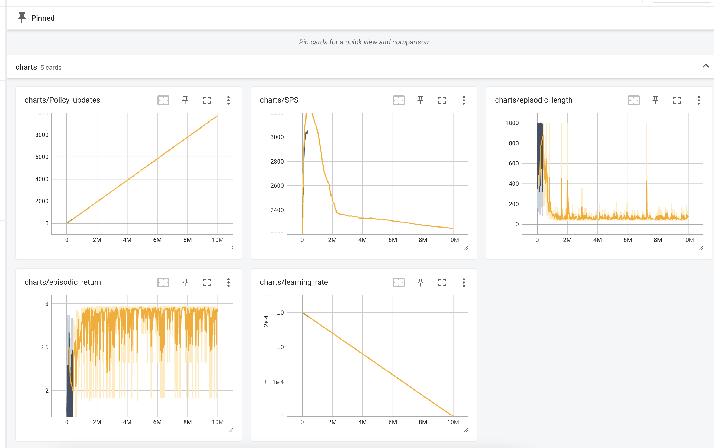
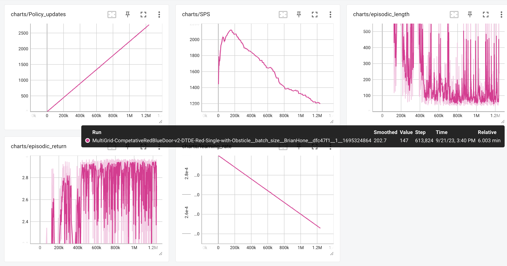

# Task 1
- Q.1 
    - num_envs - num parallel training
    - batch_size - number of timestamp per rollout
    - num_minibatches - used to calculate minibatch size
    - minibatch_size - effectively how
    - total_timesteps - total number of training iterations
    - num_updates - total number of trainign updates
    - num_steps - steps per agent per rollout
    - update_epochs - 

# Task 2
- Q.1
    - Rollout phase - line 500
    - Learning phase - line 589
- Q.2 
    - code modified

# Task 3
- Q1
    - baseline image: 
- Q2
    - reduced num_steps to cause minibatch_size to lower, 
    - everything else i changed made it perform signifcantly worse

# Task 4
- Ran out of time to complete this one.
